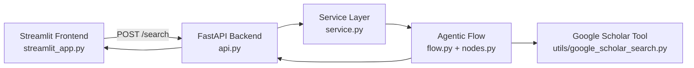

# Google Scholar Research Assistant

Google Scholar Research Assistant built with PocketFlow, FastAPI, and Streamlit.

The app flow:
1. Refine user query for Scholar retrieval.
2. Fetch real-time Google Scholar results (`title`, `snippet`, `link`).
3. Generate per-paper summaries (map) and final synthesis (reduce).
4. Enforce guardrail checks to prevent invented paper titles.

## Architecture

### Boundaries

- **Frontend**: `streamlit_app.py`
  - Collects user input and renders results.
  - Calls backend `/search` over HTTP.

- **Backend**: `api.py`, `service.py`, `flow.py`, `nodes.py`
  - `api.py`: FastAPI endpoints and request/response schemas.
  - `service.py`: shared-state construction and flow execution.
  - `flow.py` + `nodes.py`: agentic workflow implementation.

- **External tool contract**: `utils/google_scholar_search.py`
  - Source of truth for fetched papers.
  - Returns only: `title`, `snippet`, `link`.

### Contracts

- **Frontend <-> Backend HTTP contract** (defined in `api.py`)
  - Request: `query`, `recency`, `max_results`, `summary_mode`
  - Response: `refined_query`, `scholar_results`, `paper_summaries`, `final_synthesis`, `guardrail`

- **Backend internal shared-store contract** (built in `service.py`)
  - Keys: `user_input`, `refined_query`, `scholar_results`, `paper_summaries`, `final_synthesis`, `guardrail`, `search_config`



## Requirements

- Python 3.11+
- `GEMINI_API_KEY` environment variable

## Setup

### PowerShell

```powershell
python -m venv .venv
.\.venv\Scripts\Activate.ps1
pip install -r requirements.txt
```

Set API key:

```powershell
$env:GEMINI_API_KEY="your_gemini_api_key"
$env:GEMINI_MODEL="gemini-2.5-flash"
```

## Run

Start backend:

```powershell
.\.venv\Scripts\python.exe -m uvicorn api:app --host 127.0.0.1 --port 8000 --reload
```

Start frontend in another terminal:

```powershell
.\.venv\Scripts\python.exe -m streamlit run streamlit_app.py --server.port 8501
```

Open:
- API Docs: http://127.0.0.1:8000/docs
- UI: http://127.0.0.1:8501

## API Example

### Request (PowerShell)

```powershell
$body = @{ 
  query = 'graph neural networks for drug discovery'
  recency = 'past_3_years'
  max_results = 5
  summary_mode = 'single_call'  # map_reduce | single_call
} | ConvertTo-Json

Invoke-RestMethod -Uri 'http://127.0.0.1:8000/search' -Method Post -ContentType 'application/json' -Body $body
```

### Response shape

```json
{
  "refined_query": {
    "query_text": "...",
    "year_from": 2023,
    "rationale": "..."
  },
  "scholar_results": [
    {"title": "...", "snippet": "...", "link": "..."}
  ],
  "paper_summaries": [
    {"title": "...", "link": "...", "summary": "..."}
  ],
  "final_synthesis": "...",
  "guardrail": {
    "hallucination_check_passed": true,
    "violations": []
  }
}
```

## Troubleshooting

- If `No module named uvicorn` appears, run backend with the project virtualenv Python:
  - `./.venv/Scripts/python.exe -m uvicorn api:app --host 127.0.0.1 --port 8000`
- If `/search` is slow, reduce `max_results` to 3–5 for quick testing.
- If LLM quota is limited, use `summary_mode='single_call'` to reduce summarization to one LLM request.
